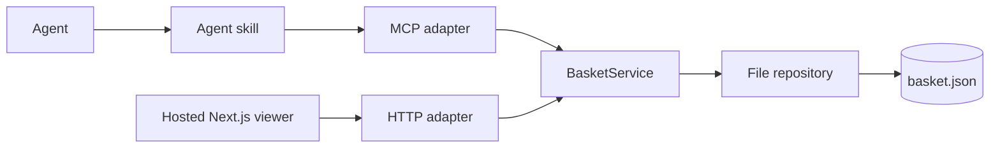

# Architecture

## Goal

MCPBasket is a neutral candidate basket, not a checkout or payment system. It records observed product data, selection state, evidence, and optional generic locators. A separate integration may consume the exported line items only after explicit user approval.

## Layers

```text
domain/          Product schemas, candidate state, normalization, summaries
application/     Basket use cases and repository contract
infrastructure/  Runtime configuration and file-backed repository
runtime/         Composition root for a local installation
transports/      MCP and HTTP adapters
presentation/    Local static viewer markup
```

The dependency direction is inward:

```text
MCP / HTTP -> runtime -> application -> domain
                    \-> infrastructure -> domain
```

Transport code validates untrusted input, calls `BasketService`, and serializes a response. It does not implement basket decisions. The service owns state transitions; domain helpers own normalization, locator detection, and totals.

## Runtime Topology



The MCP server and HTTP viewer may run in separate processes. `FileBasketRepository` protects mutations with an exclusive lock file and replaces the JSON file atomically, so the two processes share a consistent store without a database.

## Contracts

### Stable external contracts

- MCP tool names and their data shapes.
- HTTP paths documented in [`HTTP-API.md`](HTTP-API.md).
- The compact basket summary returned by `GET /api/basket`.
- Generic exported line items: `{ locator, quantity }`.

### Internal seams

`BasketRepository` is the persistence port. A future SQLite, remote, or per-user implementation can replace `FileBasketRepository` without changing MCP tools, HTTP paths, or the viewer.

`createBasketRuntime` is the composition root. It is the only layer that chooses the repository and environment configuration.

## State Model

Candidates move through `candidate`, `shortlisted`, `needs_review`, `approved`, `ready_for_checkout`, `ordered`, or `rejected`. The model does not enforce a checkout transition; it preserves the agent's observed state and leaves real purchase approval to the caller.

## Security Boundary

The local HTTP API is mutation-capable. It binds to `127.0.0.1` by default and has no authentication because it is designed for the agent's local machine. It is not a remote access API and does not issue public viewer URLs.

Mobile viewing, remote persistence, authentication, and purchase authorization belong to a separate public service. Its proposed trust boundaries and API are documented in [`REMOTE-SERVICE.md`](REMOTE-SERVICE.md); that service is not implemented in this repository.
